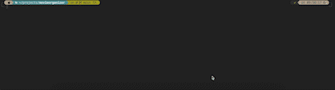

# Organize your movies with Python

## 1. What? 
Simple Python script for organizing your movie collection, gathering information from OMDb and exporting it to a .csv file. 

In current form it gathers IMDb and Rotten Tomatoes ratings, directors and release year. The [OMDb API](http://www.omdbapi.com) provides a lot more data so the script can be modified easily to take use of it.
## 2. Why? 
I wanted to list all of my physical movies in different formats, but thought it would be tedious to gather all the extra information manually. Also I thought that it would be fun to try to use Python for learning purposes. After some Google-Fu, I found that OMDb had an API which I could use for this script.
# 3 Requirements

- Python 3 (Used 3.11.3 personally)
    - [Requests library](https://pypi.org/project/requests/) for sending valid HTTP request to the API. Install with python3 -m pip install requests
- OMDb API key. You can request API key from [the website](http://www.omdbapi.com/apikey.aspx). Free API has 1000 daily request limit, so consider [supporting the developer Brian Fritz](https://www.patreon.com/join/omdb) if you like the project and need more requests.

# 4. How to? 



Add your OMDb API key to the Python file replacing "YOUR_API_KEY"
Add your movies to `movies.txt` file in the same with the Python script.
Movies should be in following format:

`$Movie, $Format`

Example:
````
The Dark Knight, 4K
Skyfall, Blu-Ray
Godfather, DVD
`````

Once your list is complete, run the Python script with `python3 catalog.py`. 

Script will create `movies_with_info.csv` file which you can then format the way you like in your spreadsheet application.